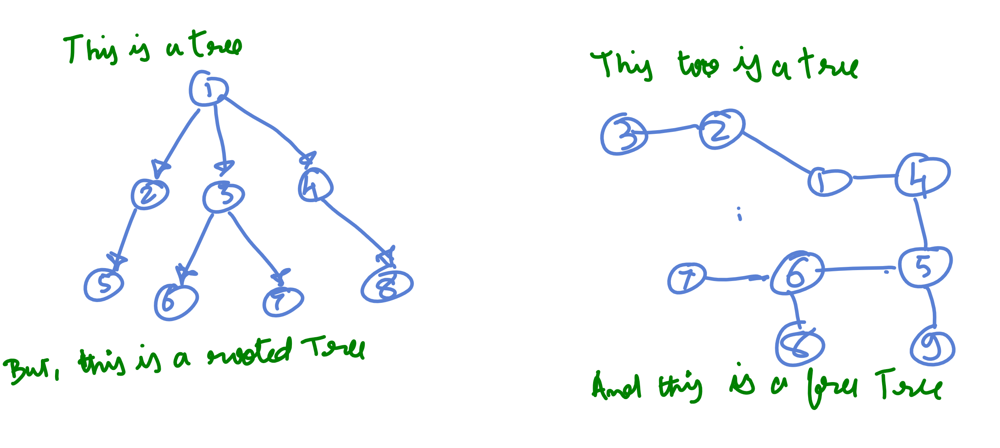

# What exactly is a Tree?

For quite some time, there used to be great confusion in my mind about the exact nature of a tree. 
# --8<-- [start:blog]
Some sources defined trees as undirected graphs and others said they were directed graphs. Some said that trees must have a root and others said, not really. It Took me some time to understand that there are in fact two different species of 'trees'.

Generally, when we talk about trees we are talking about ***rooted*** trees and to be even more specific, [***rooted out-trees***](https://www.cs.umd.edu/class/fall2019/cmsc420-0201/Lects/lect03-trees.pdf){target="_blank"}. These are linked recursive data structures in which there is a strict parent-child relationship between nodes. The root node in a rooted tree does not have a parent. All other nodes do. There are no cycles and edges are directed from parent down to its children.

A rooted out-tree in terms of graph theory is a digraph ( directed graph) such that :

* One of the vertices is a root node with no in edges.
* All other vertices have only one in-edge
* There is a path from root to all other vertices. 

A (rooted) binary tree is one in which a node can have at most two children. If there is no such restriction, then we have a (rooted) multi-way or N-ary tree

Technically, trees can also be undirected and thereby unrooted. These are defined as connected (there is a path between any two nodes), acyclic (a path cannot visit any  node twice) and undirected (an edge is two way connected) graphs. In other words, they are undirected graphs in which for any two vertices x and y, there is a ***unique simple path*** from x to y. A simple path is one in which vertices are not repeated. It is better to think of these as specific types of graphs and not confuse them with the usual rooted trees. They are also called free trees by the way.

## References: 

1. [Roooted Trees](https://www.cs.cmu.edu/afs/cs/academic/class/15210-s15/www/lectures/preliminaries-notes.pdf#page=2){target="_blank"}

2. [Unrooted Trees](https://en.wikipedia.org/wiki/Tree_(graph_theory)#:~:text=In%20graph%20theory%2C%20a%20tree%20is%20an,or%20equivalently%2C%20a%20connected%20acyclic%20undirected%20graph.){target="_blank"}

3. [Rooted vs Unrooted](https://www.cs.sfu.ca/~ggbaker/zju/math/trees.html){target="_blank"}

3. [Paths, Walks and Trails](https://www.geeksforgeeks.org/engineering-mathematics/walks-trails-paths-cycles-and-circuits-in-graph/){target="_blank"}

4. [Some theorems on Trees](https://www.geeksforgeeks.org/dsa/some-theorems-on-trees/){target="_blank"}

5. [Unique Simple Path Theorem](https://people.cs.umass.edu/~barring/cs250s12/lecture/22.pdf){target="_blank"}

6. [In-Tree vs Out-Tree](https://www.cs.umd.edu/class/fall2019/cmsc420-0201/Lects/lect03-trees.pdf){target="_blank"}

# --8<-- [end:blog]