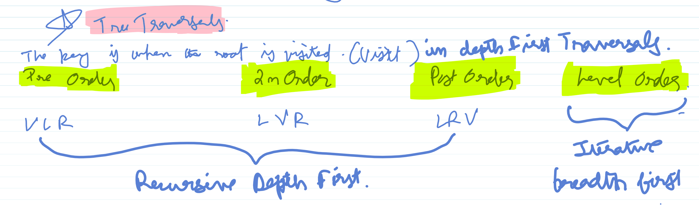

# Depth First Binary Tree Traversals

# --8<-- [start:blog]



There are two fundamental ways of traversing trees :

* Depth First 
* Level Order or Breadth First


Here , we will mainly concern ourselves with depth first traversals. When traversing binary trees depth first, you can do it in three different ways depending on when you visit the root.

## Inorder 

Left - Visit - Right(LVR) A.K.A Left - Node - Right(LNR) 

Begins at the left-most node, ends at the rightmost node. The left subtree is explored first, the root is visited next and the right subtree is explored last.

``` 
                        4
                      /   \
                     /     \  
                    2       6 
                   / \     / \ 
                  /   \   /   \
                 1     3  5    7
```

??? code "Recursive solution using implicit stack"
    ```python
    """
    In-Order Traversal : 
    Left - Root - RIght
    """
    # Definition for a binary tree node.
    # class TreeNode:
    #     def __init__(self, val=0, left=None, right=None):
    #         self.val = val
    #         self.left = left
    #         self.right = right
    class Solution:
        def inorderTraversal(self, root: Optional[TreeNode]) -> List[int]:
    
            res = []
    
            def traverse_inorder(root) :
                #Base Case
                if not root :
                    return  
    
                # Explore Left Subtree
                traverse_inorder(root.left)
    
                #Visit the root
                res.append(root.val)
                
                #Explore Right Subtree
                traverse_inorder(root.right)
    
            traverse_inorder(root)
            return res 

    ```

??? code "Iterative solution using explicit stack"
    ```python
    # Definition for a binary tree node.
    # class TreeNode:
    #     def __init__(self, val=0, left=None, right=None):
    #         self.val = val
    #         self.left = left
    #         self.right = right2
    """
    Solution for : https://leetcode.com/problems/binary-tree-inorder-traversal/description
    
    Inorder traversal is :
    Left - Visit - Right
    
    Iterative solution using explicit stack.
    This method simulates the recursive call stack with an explicit stack.
    The core idea is:
    1. Keep traversing left and pushing nodes onto the stack until you can't go left anymore.
    2. Pop a node, visit it (add its value to the result).
    3. Move to the right child of the popped node and repeat the process.
    """
    class Solution:
        def inorderTraversal(self, root: Optional[TreeNode]) -> List[int]:
            stack=[]
            res=[]
            current = root
            # Loop as long as there are nodes to process 
            while current or stack:
                #Explore the left subtree.If current is not NULL, we  go left till the leftmost leaf node
                #If current is NULL, stack must be non empty. With stack top either having the parent node of a previous visit or a leaf node which we can consider to be the parent of a NULL node. In this case, we will not enter this loop and proceed to the ascent phase in the next step.
                while current :
                    stack.append(current)
                    current = current.left 
                # Backtrack to the parent
                parent = stack.pop()
                #Visit the parent
                res.append(parent.val)
                #Explore the right subtree
                current = parent.right   
            return res
    ```

The recursive version is usually well understood. However, a detailed explanation of the iterative implementation is warranted here.  The iterative version essentially simulates the function call stack using an explicit stack.

 The best way to understand the algorithm is in terms of a two state machine which is controlled by the predicate `while current or stack`. Think of current as the root of the subtree which is currently being explored. This is initialzed to the root of the entire tree. The stack represents the suspended execution context of a Node which is to be resumed and processed later.

The state machine is in either one of two states. 

*State 1*: Descent Phase (current != null)

* Action: Push the current node onto the stack and advance the pointer to its left child (current = current.left).
* Purpose: To traverse the leftmost spine of the current subtree. This phase corresponds to recursively exploring the Left component of the LNR pattern. The stack stores the execution context (parent nodes) to be resumed.

*State 2*: Ascent & Visit Phase or backtracking (current == null and stack is not empty)

Action: Pop a node from the stack. This node's left subtree is now fully processed.
Action: Visit the popped node (append its value to the result list). This is the Node (or Root) component of LNR.
Action: Set current to the popped node's right child to initiate a new descent phase into the Right subtree.

*Invariant*: A node is only visited (popped and its value recorded) after its left subtree has been completely exhausted, perfectly enforcing the Left-Node-Right sequence.

***The terminal state of the machine is reached when current is null and stack is empty. This means there is no active subtree to explore and suspended parent context to resume.***

## Preorder 

Visit - Left - Right(VLR) A.K.A. Node-Left-Right(NLR) 

Begins at root and ends at the right most node. The root node is visited first and then left and right subtrees are explored recursively.

``` 
                        1
                      /   \
                     /     \  
                    2       5 
                   / \     / \ 
                  /   \   /   \
                 3     4  6    7
```

??? code "Recursive solution using implicit stack"
    ```python
    # Definition for a binary tree node.
    # class TreeNode:
    #     def __init__(self, val=0, left=None, right=None):
    #         self.val = val
    #         self.left = left
    #         self.right = right
    
    """
    Solution for : https://leetcode.com/problems/binary-tree-preorder-traversal/
    PreOrder traversal : Visit - Left - Right
    Recursive Solution
    """
    class Solution:
        def preorderTraversal(self, root: Optional[TreeNode]) -> List[int]:
            
            res = [] 
    
            def traverse_preorder(root) : 
                #Base case
                if not root : return
    
                #Visit the root node
                res.append(root.val)
    
                #Explore Left Subtree
                traverse_preorder(root.left) 
    
                #Explore Right Subtree
                traverse_preorder(root.right)
            
            traverse_preorder(root)
            return res

    ```

??? code "Iterative solution using explicit stack"
    ```python
    # Definition for a binary tree node.
    # class TreeNode:
    #     def __init__(self, val=0, left=None, right=None):
    #         self.val = val
    #         self.left = left
    #         self.right = right
    
    """
    Solution for : https://leetcode.com/problems/binary-tree-preorder-traversal/
    PreOrder traversal : Visit - Left - Right
    Iterative Solution
    """
    class Solution:
        def preorderTraversal(self, root: Optional[TreeNode]) -> List[int]:
            
            stack = []
            res = [] 
            current = root
            while current or stack:
                #Visit the root of this subtree and explore its left subtree 
                while current :
                    res.append(current.val)
                    stack.append(current)
                    current = current.left
                # Backtrack to Parent and explore its right subtree    
                parent = stack.pop()
                current = parent.right
            
            return res

    ```
The iterative solution for preorder traversal uses the same two-state machine, but performs the "visit" action before exploring the left subtree.

*State 1*: Visit & Descent Phase (current != null)

* Action: Visit the current node immediately (append its value to the result list). This is the Node (or Root) component of NLR.

* Action: Push the current node onto the stack to save its context (specifically, its right child) for later.

* Action: Advance the pointer to its left child (current = current.left). This explores the Left component.

*State 2*: Ascent Phase or Backtracking (current == null and stack is not empty)

* Action: Pop a node from the stack. Its left subtree has been fully processed.
* Action: Set current to the popped node's right child to initiate a new visit & descent phase into the Right subtree.

*Invariant*: A node is visited the moment it is first encountered, before any descent into its children, enforcing the Node-Left-Right sequence.

## Postorder 

Left - Right - Visit(LRV) A.K.A Left - Right - Node (LRN)

Begins at the left most node and ends at the root node. 

``` 
                        7
                      /   \
                     /     \  
                    3       6 
                   / \     / \ 
                  /   \   /   \
                 1     2  4    5
```

??? code "Recursive solution using implicit stack"
    ```python
    # Definition for a binary tree node.
    # class TreeNode:
    #     def __init__(self, val=0, left=None, right=None):
    #         self.val = val
    #         self.left = left
    #         self.right = right
    class Solution:
        def postorderTraversal(self, root: Optional[TreeNode]) -> List[int]:
            res = []
            def traverse_postorder(root) :
                #base case
                if not root : return 
                
                # left
                traverse_postorder(root.left)
                # right
                traverse_postorder(root.right)
                # visit
                res.append(root.val)
            traverse_postorder(root)
            return res
    ```

??? code "Iterative solution using explicit stack"
    ```python
       # Definition for a binary tree node.
       # class TreeNode:
       #     def __init__(self, val=0, left=None, right=None):
       #         self.val = val
       #         self.left = left
       #         self.right = right
       class Solution:
           def postorderTraversal(self, root: Optional[TreeNode]) -> List[int]:
               
               stack = []
               res = []
               last_visited = None
               current = root
       
               while current or stack :
                   #State 1 : Descent 
                   #Explore the left subtree
                   while current :
                       stack.append(current)
                       current = current.left
                   peek_node = stack[-1]
                   #State 2 : Ascent 
                   #Decision A
                   # The right subtree is not explored yet
                   # Tip : Don't forget to check that peek_node.right is not None or you will end up in an infinite loop by comparing None with None.
                   if   peek_node.right and peek_node.right != last_visited : 
                       current = peek_node.right # Descend into right subtree
                   #Decision B
                   # Either We already processed the right subtree or the right subtree is NULL. 
                   # So, it is time to visit its parent
                   else :
                       parent = stack.pop()
                       res.append(parent.val)
                       last_visited = parent
                       # Continue ascent by keep current as NULL
                   
               return res
    ```


 Iterative postorder traversal is the most complex of the three because it requires us to delay visiting a node until both of its children have been fully processed. This introduces a new challenge: when we return to a node from a subtree, we must know whether we came from the left (and must now go right) or came from the right (and can finally visit the node). The most common and efficient one-stack solution uses a last_visited_node pointer to check if the right subtree has already been processed.


The iterative algorithm using a single stack operates as a two-state machine, but its second state is more complex, involving a critical decision-making step.

*State 1*: Descent Phase (current != null)

* Action: Push the current node onto the stack and advance the pointer to its left child (current = current.left).
* Purpose: To traverse and stack the leftmost spine of any given subtree. This corresponds to exploring the Left component of the LRN pattern. The node is pushed to suspend its execution.

*State 2*: Ascent & Decision Phase (current == null and stack is not empty)

* Action: Peek at the node on top of the stack (peek_node). Do not pop it yet.
* Purpose: The algorithm must now decide its next move. We are at peek_node because its left subtree is fully processed. The question is: has its right subtree also been processed?
* Decision Logic:
If peek_node has a right child AND that child is NOT the last_visited_node: This means the Right subtree must be explored. The algorithm transitions back to the Descent Phase by setting current = peek_node.right.
Else (if peek_node has no right child OR its right child was the last_visited_node): This confirms that both the Left and Right subtrees are fully processed. The algorithm can now perform the visit.
* Action: Pop the node from the stack.
* Action: Visit the node by appending its value to the result list. This is the Node component of LRN.
* Action: Update last_visited_node to this newly visited node.
* Action: Keep current = None. This is crucial. It ensures the while loop continues in the Ascent & Decision Phase, processing the next node on the stack.

*Invariant*: A node is only visited (popped and its value recorded) after the algorithm confirms that both its left child (by completing the initial descent) and its right child (by checking last_visited_node) have been fully processed, strictly enforcing the Left-Right-Node sequence.


??? code "Iterative solution using modified preorder traversal"
    ```python
    # Definition for a binary tree node.
    # class TreeNode:
    #     def __init__(self, val=0, left=None, right=None):
    #         self.val = val
    #         self.left = left
    #         self.right = right
    class Solution:
        def postorderTraversal(self, root: Optional[TreeNode]) -> List[int]:
            stack = []
            res = []
            current = root
    
            while current or stack :
                #Visit and descent
                #Vist current node and descend into the right subtree
                while current : 
                    #visit 
                    res.append(current.val)
                    #store execution state on stack for backtracking to left subtree later
                    stack.append(current)
                    #descend into the right subtree
                    current = current.right
                
                #ascent
                #backtrack 
                parent = stack.pop()
                #and descend to the left subtree
                current = parent.left
    
            res.reverse()
            return res
    ```

You could avoid all this headache by exploiting the relationship between Preorder and Postorder traversals. 

* Preorder : Node - Left - Right
* Postorder : Left - Right - Node

Notice that if we reverse the preorder sequence of actions we get Right - Left - Node.
But what if we did the preorder traversal like this : Node - Right - Left?

Now, the reversal of this sequence is Left - Right - Node which is exactly the same as postorder traversal.

Is is as simple as that! You can do all three iterative traversals using the simpler state machine approach.


## A Note on the role of the stack

In all three iterative traversals, the stack's fundamental role is to simulate the function call stack of recursion by saving the execution context of a node so its processing can be suspended and resumed later. This is done by backtracking which corresponds to popping a node from the stack to return to a previously suspended execution context.

The key difference lies in what specific part of the execution context is being saved:

* Inorder (LNR): When a node is pushed, you are saving the context to first visit this node, then explore its right subtree. This entire block of work is deferred until after its left subtree is fully processed.

* Preorder (NLR): Since you visit the node before pushing, you are only saving the context to explore its right subtree. The "visit" part of its context is already complete.

* Postorder (LRN): When a node is pushed, you are saving the most complex context: the obligation to first explore its left and right subtrees, and then finally visit the node itself. Its execution is suspended until both children's subtrees are fully processed.

# --8<-- [end:blog]