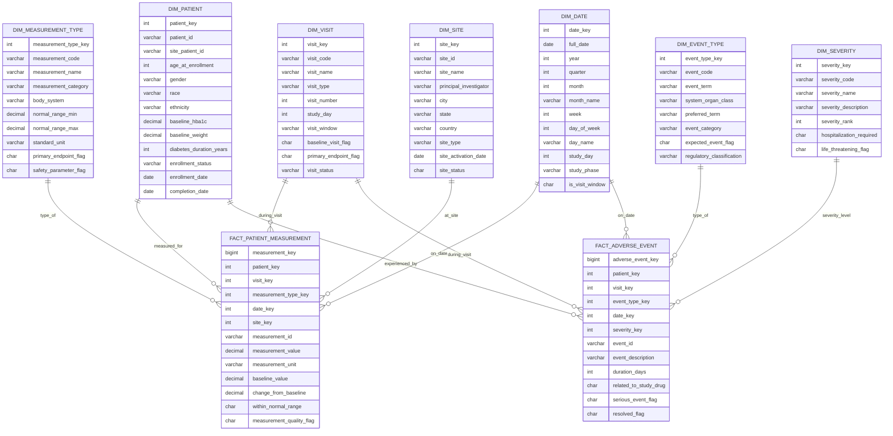

# Dimensional Data Modeling Cheatsheet

## Core Concepts

### What is Dimensional Modeling?
A design technique for data warehouses that organizes data into **facts** (measurable events) and **dimensions** (descriptive context) to support fast analytical queries and business intelligence.

### Key Benefits
- **Query Performance**: Optimized for analytical workloads
- **Business User Friendly**: Intuitive structure matching business processes
- **Scalable**: Handles large data volumes efficiently
- **Flexible**: Supports drilling down and rolling up through hierarchies

## Building Blocks

### Fact Tables
Central tables containing quantitative, measurable data about business events.

**Characteristics:**
- Large number of rows (transactions, events)
- Foreign keys to dimension tables
- Additive measures (sales amount, quantity)
- Sparse data (many null values acceptable)

**Types of Facts:**
- **Transactional**: Individual business events
- **Periodic Snapshot**: Regular intervals (daily, monthly)
- **Accumulating Snapshot**: Process lifecycle tracking

### Dimension Tables
Provide descriptive context for facts - the "who, what, when, where, why" of business events.

**Characteristics:**
- Relatively small number of rows
- Wide tables with many descriptive attributes
- Primary keys (often surrogate keys)
- Denormalized for query performance

**Common Dimensions:**
- **Customer**: Demographics, preferences, segments
- **Product**: Categories, brands, specifications
- **Time**: Hierarchies, fiscal calendars, holidays
- **Geography**: Regions, territories, locations

## Schema Patterns

### Star Schema
**Structure:** Central fact table directly connected to dimension tables
```
    Customer
        |
Product — Fact — Store
        |
      Date
```

**Advantages:**
- Simple structure, easy to understand
- Faster query performance (fewer joins)
- Optimized for business intelligence tools

**Use When:**
- Query performance is priority
- Business users need simple models
- Storage redundancy is acceptable

### Snowflake Schema
**Structure:** Normalized dimensions broken into multiple related tables
```
    Customer
        |
     City — State — Country
        |
Product — Fact — Store
   |              |
Category       Region
   |
 Brand
```

**Advantages:**
- Reduced data redundancy
- Better data integrity
- Smaller storage footprint

**Use When:**
- Storage efficiency is critical
- Large dimension tables need normalization
- Data integrity is paramount

### Galaxy Schema
**Structure:** Multiple fact tables sharing common dimensions
```
Dimension1 — Fact1 — Dimension2
    |           |
    |         Fact2 — Dimension3
    |           |
Dimension4 ————————
```

**Use When:**
- Multiple business processes
- Complex enterprise requirements
- Shared dimensions across processes

## Essential Design Principles

### Grain Definition
**Most Critical Decision:** What does each row in the fact table represent?

**Examples:**
- One row per sales transaction
- One row per daily inventory snapshot
- One row per customer interaction

**Rules:**
- Must be consistent throughout fact table
- Determines what questions can be answered
- All measures must be at same grain level

### Slowly Changing Dimensions (SCD)
Handle changes to dimensional attributes over time.

**Type 1: Overwrite**
- Replace old value with new value
- No history preserved
- Use for: Corrections, low-importance changes
    ```sql
    UPDATE Customer SET City = 'New York' WHERE CustomerID = 123
    ```

**Type 2: Add New Record**
- Create new record with effective dates
- Preserves complete history
- Use for: Important attribute changes
    ```sql
    -- Original record
    CustomerKey | CustomerID | Name | City | EffectiveDate | ExpirationDate
    501         | 123        | John | Boston | 2020-01-01  | 2023-12-31
    
    -- New record after move
    502         | 123        | John | NYC    | 2024-01-01  | 9999-12-31
    ```

**Type 3: Add New Column**
- Keep both old and new values
- Limited history (usually current + previous)
- Use for: Predictable changes, limited tracking
    ```sql
    CustomerKey | Name | CurrentCity | PreviousCity
    501         | John | NYC         | Boston
    ```

### Surrogate Keys
Artificial primary keys (usually integers) for dimension records.

**Benefits:**
- Stable references when business keys change
- Better join performance
- Handle multiple source systems
- Support slowly changing dimensions

**Implementation:**
```sql
-- Instead of natural key
ProductKey | ProductCode | ProductName | Category
201        | SKU-12345   | iPhone 15   | Electronics

-- Fact table references surrogate key
SalesKey | ProductKey | CustomerKey | SalesAmount
1001     | 201        | 501         | 999.00
```

## Common Patterns

### Conformed Dimensions
Shared dimensions across multiple fact tables ensuring consistent analysis.

**Example:**
- Customer dimension used by Sales, Support, and Marketing facts
- Date dimension shared across all business processes
- Product dimension used by Sales, Inventory, and Returns

**Benefits:**
- Consistent metrics across business areas
- Integrated reporting capabilities
- Simplified ETL processes

### Degenerate Dimensions
Dimensional data stored directly in fact table (no separate dimension table).

**Common Examples:**
- Order numbers, invoice numbers
- Transaction IDs, ticket numbers
- Serial numbers, batch codes

**When to Use:**
- Only identifier exists (no descriptive attributes)
- High cardinality with little analytical value
- Performance optimization for grouping

```sql
-- OrderNumber stored in fact table
SalesID | CustomerKey | ProductKey | OrderNumber | SalesAmount
1001    | 501         | 201        | ORD-12345   | 125.99
1002    | 501         | 203        | ORD-12345   | 89.50
```

### Junk Dimensions
Consolidate low-cardinality flags and indicators.

**Example:**
```sql
-- Instead of separate dimensions for each flag
JunkKey | PaymentType | ShippingType | GiftWrap | Priority
901     | Credit      | Standard     | No       | Normal
902     | Credit      | Express      | Yes      | High
903     | Debit       | Standard     | No       | Normal
```

**Benefits:**
- Reduces fact table width
- Eliminates tiny dimension tables
- Groups related operational flags

### Role-Playing Dimensions
Same dimension used multiple times in single fact table.

**Example:**
```sql
-- Date dimension used for multiple date types
SalesID | CustomerKey | OrderDateKey | ShipDateKey | DeliveryDateKey
1001    | 501         | 20240115     | 20240116    | 20240118
```

**Implementation:**
- Create views or aliases for each role
- Use descriptive names in fact table
- Maintain same dimension structure

## Design Best Practices

### Fact Table Design
1. **Choose Atomic Grain**: Store data at lowest level of detail
2. **Additive Measures**: Prefer measures that can be summed
3. **Consistent Grain**: All measures at same level of detail
4. **Minimize NULLs**: Use dimension attributes instead of fact NULLs

### Dimension Design
1. **Descriptive Attributes**: Include all relevant business context
2. **User-Friendly Names**: Use business terminology
3. **Hierarchies**: Support drill-down analysis paths
4. **Surrogate Keys**: Always use for dimension primary keys

### Performance Optimization
1. **Indexing Strategy**:
    - Clustered indexes on fact table date columns
    - Foreign key indexes on fact tables
    - Covering indexes for common query patterns

2. **Partitioning**:
    - Partition large fact tables by date
    - Consider customer-based partitioning for very large customers
    - Implement partition elimination in queries

3. **Aggregation**:
    - Pre-aggregate common summary levels
    - Create OLAP cubes for frequent analysis patterns
    - Maintain incremental refresh processes

## Implementation Checklist

### Planning Phase
- [ ] Define business requirements and KPIs
- [ ] Identify source systems and data quality
- [ ] Determine fact table grain and measures
- [ ] Design dimension hierarchies and attributes
- [ ] Plan for slowly changing dimensions

### Development Phase
- [ ] Create staging area for data cleansing
- [ ] Implement surrogate key generation
- [ ] Build ETL processes with error handling
- [ ] Create data quality validation rules
- [ ] Implement SCD processing logic

### Testing Phase
- [ ] Validate business rules and calculations
- [ ] Test slowly changing dimension scenarios
- [ ] Verify referential integrity
- [ ] Performance test with realistic data volumes
- [ ] User acceptance testing with business users

### Deployment Phase
- [ ] Set up production environments
- [ ] Implement monitoring and alerting
- [ ] Create user documentation and training
- [ ] Establish maintenance procedures
- [ ] Plan for ongoing support and enhancements

## Common Pitfalls to Avoid

### Design Mistakes
- **Inconsistent Grain**: Mixing transaction and summary data in same fact
- **Over-normalization**: Creating snowflake when star would suffice
- **Missing Business Keys**: Not storing original system identifiers
- **Inadequate SCD Planning**: Not considering how dimensions change

### Performance Issues
- **Too Many Dimensions**: Overly wide fact tables
- **Large Dimension Tables**: Not using mini-dimensions for large cardinality
- **Poor Partitioning**: Not aligning with query patterns
- **Missing Indexes**: Inadequate indexing strategy

### Data Quality Problems
- **Duplicate Records**: Lack of proper matching and deduplication
- **Orphaned Facts**: Facts without corresponding dimensions
- **Inconsistent Formatting**: Different formats across source systems
- **Late Arriving Data**: Not handling out-of-sequence data loads

## Quick Reference

### When to Use Star vs Snowflake
**Star Schema:**
- Performance is critical
- Business users directly query
- Storage cost is not major concern
- Simpler maintenance requirements

**Snowflake Schema:**
- Storage efficiency important
- Large dimension tables
- Strong normalization requirements
- Complex data relationships

### SCD Type Selection
**Type 1:** Corrections, unimportant changes
**Type 2:** Critical business changes requiring history
**Type 3:** Predictable changes with limited history needs

### Grain Selection Guidelines
- Start with most atomic level possible
- Consider storage and performance implications
- Ensure all business questions can be answered
- Plan for future analytical requirements

## E-commerce Star Schema Example

### Business Scenario

Imagine you're working at an online retailer that sells consumer electronics. The business stakeholders come to you with a requirement: "We need to analyze our sales performance to understand which products are selling well, who our best customers are, and how our different stores are performing."

This is a classic dimensional modeling challenge. Let's walk through the thought process of designing a data warehouse to solve this problem.

### Understanding the Business Questions

Before we start designing tables, we need to understand what questions the business wants to answer. The stakeholders tell us they want to know:

- Which products are our top sellers by month?
- Who are our highest-value customers by region?
- How do weekend sales compare to weekday sales?
- Which stores generate the most revenue?
- What's the average order value by customer segment?

These questions give us clues about what our dimensional model should look like. We can see that we need to track sales events (facts) and analyze them by product, customer, time, and store (dimensions).

### Choosing the Grain

The most critical decision in dimensional modeling is selecting the grain - what does each row in our fact table represent? We have several options:

We could track at the **order level** (one row per order), but this wouldn't let us analyze individual products. We could track at the **daily summary level** (one row per product per day), but this might lose important detail.

For our e-commerce scenario, we choose **line item level** - one row per product in each order. This atomic grain gives us maximum flexibility. We can always aggregate up to order level or daily level, but we can't drill down if we start with summarized data.

### Designing Our Star Schema


### Fact Table Design Reasoning

Our fact table contains the measurable events - the actual sales transactions. Let's think through each component:

**Surrogate Key**: `sales_key` is an artificial primary key. We don't use the natural order number because multiple line items can exist per order.

**Foreign Keys**: Each foreign key points to a dimension table. Notice how `customer_key`, `product_key`, `date_key`, and `store_key` connect our fact to the descriptive information.

**Degenerate Dimension**: `order_number` stays in the fact table because while it's dimensional (we want to group by order), it has no descriptive attributes that warrant a separate table.

**Measures**: These are the numbers we want to analyze:
- `quantity`: How many items were sold
- `unit_price`: Price per item (may differ from list price due to promotions)
- `discount_amount`: Discount applied to this line item
- `total_amount`: Final amount for this line item

Notice that all measures are at the same grain (per line item) and are mostly additive - we can sum them across different dimensions to get meaningful totals.

### Dimension Design Reasoning

#### Customer Dimension - The "Who"

We chose SCD Type 1 (overwrite changes) for simplicity. In a real scenario, you might want SCD Type 2 if tracking customer moves is important for regional analysis.

The dimension includes geographic information (city, state, country) because the business wants regional analysis. Customer segmentation helps with targeted analysis.

#### Product Dimension - The "What"

Products are organized in a simple hierarchy: Category → Brand → Product. This denormalized approach (keeping all levels in one table) follows star schema principles - it's faster to query than a normalized snowflake approach.

We include both cost and list price because:
- Cost enables profit analysis
- List price vs. unit price in facts shows promotional impact

#### Date Dimension - The "When"

The date dimension is crucial for time-based analysis. We include:
- Calendar attributes (year, quarter, month)
- Day-of-week information for weekday vs. weekend analysis
- Holiday flags for seasonal analysis

Each date gets its own row (one row per day), and we'll have thousands of rows spanning several years.

#### Store Dimension - The "Where"

This covers both physical stores and online channels. The `store_type` field distinguishes between "Physical", "Online", and "Mobile" channels.

Geographic hierarchy (city, state, region) enables territorial analysis for operations and sales management.

#### How the Model Answers Business Questions

Let's trace through how our design answers the original business questions:

**"Which products are our top sellers by month?"**
```sql
SELECT 
    d.year, d.month_name, p.product_name,
    SUM(f.quantity) as units_sold,
    SUM(f.total_amount) as revenue
FROM fact_sales f
JOIN dim_date d ON f.date_key = d.date_key
JOIN dim_product p ON f.product_key = p.product_key
WHERE d.year = 2024
GROUP BY d.year, d.month_name, p.product_name
ORDER BY d.month, revenue DESC;
```

**"How do weekend sales compare to weekday sales?"**
```sql
SELECT 
    CASE WHEN d.is_weekend = 'Y' THEN 'Weekend' ELSE 'Weekday' END as day_type,
    COUNT(*) as transaction_count,
    SUM(f.total_amount) as total_sales,
    AVG(f.total_amount) as avg_transaction_value
FROM fact_sales f
JOIN dim_date d ON f.date_key = d.date_key
GROUP BY CASE WHEN d.is_weekend = 'Y' THEN 'Weekend' ELSE 'Weekday' END;
```

Notice how the star schema makes these queries intuitive - we join the fact table to the dimensions we need and aggregate the measures.

#### Design Trade-offs and Alternatives

**Why Star Instead of Snowflake?**
We could have normalized the product dimension into separate Category and Brand tables. However, the star schema approach offers:
- Simpler queries (fewer joins)
- Better performance for analytical workloads
- Easier understanding for business users
- Most BI tools are optimized for star schemas

**Why This Grain?**
Line-item level gives us maximum analytical flexibility. The trade-off is larger fact table size, but storage is usually less expensive than the loss of analytical capability.

**SCD Type Decisions**
We chose Type 1 for simplicity, but in production you might want:
- Type 2 for Customer if regional sales history matters when customers move
- Type 2 for Product if price history analysis is important
- Type 1 for Store (store characteristics rarely change significantly)

#### Extending the Model

As business requirements evolve, this model can grow:

**Additional Dimensions**: Promotion, Sales Rep, Payment Method
**Additional Facts**: Returns, Inventory, Customer Service interactions
**Enhanced Attributes**: Customer demographics, product specifications, store performance metrics

The key is starting with a solid foundation that answers the core business questions, then evolving the model based on new requirements.

#### Sample Data to Visualize the Concept

```sql
-- Sample fact data showing the grain
sales_key | customer_key | product_key | date_key | store_key | order_number | quantity | unit_price | total_amount
1001      | 501          | 201         | 20240315 | 101       | ORD-12345    | 2        | 99.99      | 199.98
1002      | 501          | 203         | 20240315 | 101       | ORD-12345    | 1        | 49.99      | 49.99
1003      | 502          | 201         | 20240316 | 102       | ORD-12346    | 1        | 99.99      | 99.99

-- Customer dimension sample
customer_key | customer_id | customer_name | city    | state | customer_segment
501          | CUST-001    | John Smith    | Seattle | WA    | VIP
502          | CUST-002    | Jane Doe      | Portland| OR    | Regular

-- Product dimension sample  
product_key | product_id | product_name | category    | brand  | list_price
201         | SKU-001    | iPhone 15    | Electronics | Apple  | 999.99
203         | SKU-003    | AirPods Pro  | Electronics | Apple  | 249.99
```

Notice how the same order (ORD-12345) appears in multiple fact records because John Smith bought two different products. This is the line-item grain in action.

#### Key Takeaways for Interviews

When discussing this model in an interview context, emphasize:

1. **Grain Selection**: Explain why line-item level was chosen and what alternatives existed
2. **Business Alignment**: Show how the design directly supports stated business requirements  
3. **Query Performance**: Demonstrate how star schema enables fast, intuitive queries
4. **Scalability**: Discuss how the model can evolve with new requirements
5. **Trade-offs**: Acknowledge the storage vs. flexibility trade-off and why it's worth it

This example demonstrates solid dimensional modeling fundamentals while remaining simple enough to explain clearly in an interview setting.

## Clinical Trial Galaxy Schema Example

### Business Scenario

You're working as a data architect for a pharmaceutical company conducting a Phase III clinical trial for a new diabetes medication. The study involves 500 patients across 25 clinical sites over 18 months. The regulatory team, biostatisticians, and clinical operations team have come to you with complex analytical requirements.

This scenario differs fundamentally from typical business intelligence challenges because clinical trials operate under strict regulatory requirements (FDA, EMA), require sophisticated statistical analysis, and involve patient safety monitoring. Let's explore how dimensional modeling adapts to these unique challenges.

### Understanding Clinical Trial Complexity

Clinical trials generate multiple types of data that need to be analyzed together:

**Efficacy Data**: How well does the drug work? Primary endpoint is reduction in HbA1c (blood sugar control). Secondary endpoints include weight loss, blood pressure improvement, and quality of life scores.

**Safety Data**: What adverse events occur? Every headache, nausea, or serious event must be tracked, categorized, and analyzed for patterns. Regulatory agencies require detailed safety reporting.

**Operational Data**: Are we following the protocol? Visit scheduling, protocol deviations, and site performance all impact trial success and regulatory approval.

The key insight is that we have fundamentally different types of business events happening - patient measurements and adverse events - that need separate fact tables but must be analyzed together. This leads us to a galaxy schema design.

### Designing the Galaxy Schema



### Why Galaxy Schema Instead of Star?

The fundamental decision here is using multiple fact tables instead of trying to force everything into a single fact. Here's the reasoning:

**Different Grains**: Patient measurements happen at scheduled visits with precise protocols. Adverse events can happen anytime and are reported whenever discovered. Trying to combine these into one fact table would create a confusing grain.

**Different Measures**: Efficacy measurements are quantitative (HbA1c = 7.2%) while adverse events are qualitative (severity = "Moderate"). The measures don't make sense together.

**Different Analysis Patterns**: Efficacy analysis focuses on statistical change over time. Safety analysis focuses on event rates and patterns. These require different analytical approaches.

**Regulatory Requirements**: FDA submissions require separate efficacy and safety sections with different statistical methodologies. Our data model should align with regulatory reporting needs.

### Fact Table Design Deep Dive

#### Patient Measurement Fact - The Efficacy Story

This fact table captures every measurement taken on every patient at every visit. The grain is: **one row per measurement type per patient per visit**.

**Pre-calculated Change from Baseline**: Rather than calculating this at query time, we store `baseline_value` and `change_from_baseline`. This is crucial because:
- Baseline calculations are complex (what if a patient missed their baseline visit?)
- Statistical software expects pre-calculated changes
- Performance is critical for large datasets with frequent analysis

**Data Quality Flags**: `within_normal_range` and `measurement_quality_flag` capture data quality issues that are crucial for regulatory submissions. Outlier values need flagging and explanation.

**Why This Grain**: We could aggregate to visit level, but measurement-level detail enables:
- Analysis of specific biomarkers
- Missing data pattern analysis
- Quality control at the measurement level

#### Adverse Event Fact - The Safety Story

This fact table captures every adverse event reported during the study. The grain is: **one row per adverse event occurrence**.

**Relationship to Study Drug**: `related_to_study_drug` is a critical regulatory field. Investigators must assess whether each event is related to the study medication.

**Duration Tracking**: `duration_days` enables analysis of how long events last, which impacts quality of life and drug tolerability.

**Regulatory Classification**: Different event types have different regulatory reporting requirements. Serious events must be reported to authorities within 24 hours.

### Dimension Design for Clinical Context

#### Patient Dimension - The Study Population

Unlike typical customer dimensions, patient characteristics are mostly fixed at enrollment. We use SCD Type 1 because:
- Demographics don't change during the study
- Medical history is captured at baseline
- Any changes (like diabetes duration) are captured through measurements, not dimension updates

**Baseline Medical Information**: `baseline_hba1c`, `baseline_weight`, and `diabetes_duration_years` enable subgroup analysis. Regulatory agencies want to know if the drug works differently in different patient populations.

**Enrollment Tracking**: `enrollment_status` tracks patients through the study lifecycle (Screened, Enrolled, Completed, Withdrawn). This is crucial for statistical analysis and regulatory compliance.

#### Visit Dimension - The Protocol Framework

Clinical trials follow strict visit schedules defined in the protocol. This dimension captures that structure:

**Study Day**: Calculated from enrollment date, enabling analysis aligned with the study timeline rather than calendar dates.

**Visit Windows**: Protocols allow visits within acceptable windows (e.g., Week 12 visit can occur between Day 80-90). `visit_window` enables protocol compliance analysis.

**Primary Endpoint Visits**: `primary_endpoint_flag` identifies visits where the main efficacy measurement occurs. These are crucial for the primary statistical analysis.

#### Measurement Type Dimension - Clinical Standardization

This dimension standardizes all the different measurements taken in the study:

**Clinical Hierarchy**: `body_system` and `measurement_category` organize measurements (Endocrine → Glucose Control → HbA1c).

**Reference Ranges**: `normal_range_min` and `normal_range_max` enable automated flagging of abnormal values for safety monitoring.

**Study Relevance**: `primary_endpoint_flag` and `safety_parameter_flag` distinguish between different analysis categories for regulatory reporting.

#### Event Type Dimension - Medical Coding

Adverse events must be coded using standardized medical terminology (MedDRA - Medical Dictionary for Regulatory Activities):

**Hierarchy**: `system_organ_class` → `preferred_term` → `event_term` follows MedDRA structure. For example: "Gastrointestinal disorders" → "Nausea" → "Nausea after meals".

**Regulatory Classification**: `expected_event_flag` indicates whether the event is listed in the drug's safety profile. Unexpected events require special reporting.

### Complex Analysis Examples

#### Primary Efficacy Analysis

```sql
-- Mean change from baseline in HbA1c by visit
SELECT 
    v.visit_name,
    v.study_day,
    COUNT(DISTINCT pm.patient_key) as patient_count,
    AVG(pm.change_from_baseline) as mean_change,
    STDDEV(pm.change_from_baseline) as std_deviation
FROM fact_patient_measurement pm
JOIN dim_measurement_type mt ON pm.measurement_type_key = mt.measurement_type_key
JOIN dim_visit v ON pm.visit_key = v.visit_key
WHERE mt.measurement_code = 'HBA1C'
    AND v.primary_endpoint_flag = 'Y'
GROUP BY v.visit_name, v.study_day, v.visit_number
ORDER BY v.visit_number;
```

This query answers the fundamental question: "Is the drug working?" Statistical significance testing would be applied to these results.

#### Safety Signal Detection

```sql
-- Adverse events by body system - looking for concerning patterns
SELECT 
    et.system_organ_class,
    COUNT(*) as total_events,
    COUNT(DISTINCT ae.patient_key) as patients_affected,
    COUNT(DISTINCT ae.patient_key) * 100.0 / 
        (SELECT COUNT(DISTINCT patient_key) FROM dim_patient WHERE enrollment_status = 'Enrolled') as incidence_rate,
    SUM(CASE WHEN ae.related_to_study_drug = 'Y' THEN 1 ELSE 0 END) as drug_related_events
FROM fact_adverse_event ae
JOIN dim_event_type et ON ae.event_type_key = et.event_type_key
GROUP BY et.system_organ_class
ORDER BY incidence_rate DESC;
```

This analysis helps identify safety